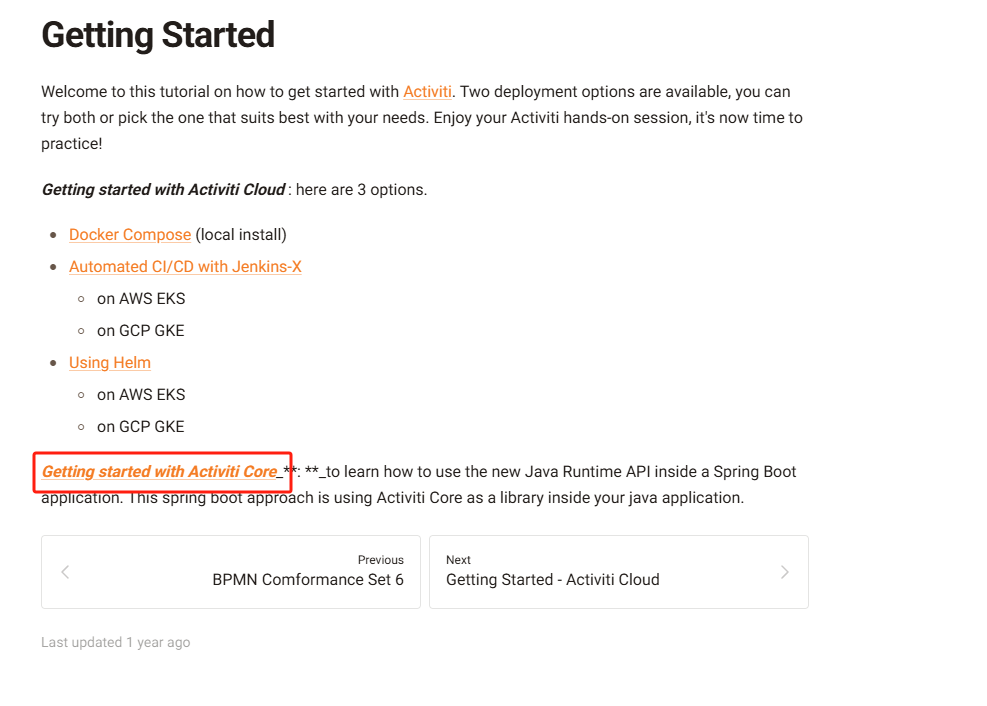

# 此项目用来了解activiti7的各个service功能
```java
1. 主要功能写在 src/test/java/com/baihailang/test/Test.java
2. 搭建环境需要使用mysql数据库,jdk8u211以上
3. 如需集成springboot请查看spring-activiti模块
```
* [activiti官网学习文档](https://activiti.gitbook.io/activiti-7-developers-guide/getting-started)
参考core的


